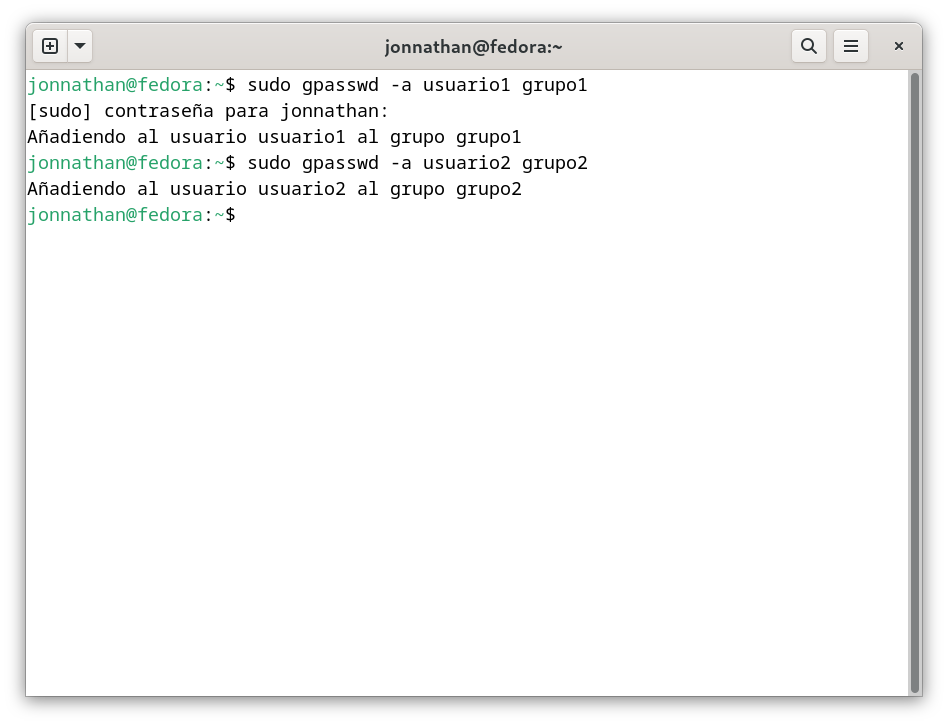

# Parte 1

1. **Creación de Usuarios:** Crea tres usuarios llamados 'usuario1', 'usuario2' y 'usuario3'

```
sudo useradd usuario1
```

```
sudo useradd usuario2
```

```
sudo useradd usuario3
```

2. **Asignación de Contraseñas:** Establece una nueva contraseña para cada usuario creado

```
sudo passwd usuario1
```

```
sudo passwd usuario2
```

```
sudo passwd usuario3
```


3. **Información de Usuarios:** Muestra la información de 'usuario1' usando el comando 'id'

```
id usuario1
```


4. **Eliminación de Usuarios:** Elimina 'usuario3', pero conserva su directorio principal

```
sudo userdel usuario3
```

# Parte 2: Gestión de Grupos

1. **Creación de Grupos:** Crea dos grupos llamados 'grupo1' y 'grupo2'

```
sudo groupadd grupo1
```

```
sudo groupadd grupo2
```

2. **Agregar Usuarios a Grupos:** Agrega 'usuario1' a 'grupo1' y 'usuario2' a 'grupo2'

```
sudo gpasswd -a usuario1 grupo1
```

```
sudo gpasswd -a usuario2 grupo2
```



3. **Verificar Membresía:** Verifica que los usuarios han sido agregados a los grupos utilizando el comando 'groups'

```
groups usuario1 usuario2
```


4. **Eliminar Grupo:** Elimina 'grupo2'

```
sudo groupdel grupo2
```

# Parte 3: Gestión de Permisos

1. **Creación de Archivos y Directorios:**

- Como 'usuario1', crea un archivo llamado 'archivo1.txt' en su directorio principal y escribe algo en él

Cambiar a usuario1

```
su usuario1
```

Ingresar al directorio home

```
cd ~
```

Crear archivo archivo1.txt

```
touch archivo1.txt
```

Editando el archivo con vi

```
vi archivo1.txt
```

Para salir y guardar del editor vi

```
:wq
```


- Crea un directorio llamado 'directorio1' y dentro de ese directorio, un archivo llamado 'archivo2.txt'

Crear directorio

```
mkdir directorio1
```

Crear archivo 'archivo2.txt'

```
touch directorio1/archivo2.txt
```

2. **Verificar Permisos:** Verifica los permisos del archivo y directorio usando el comando 'ls -l' y 'ls -id' respectivamente


3. **Modificar Permisos usando 'chmod' con Modo Númerico:** Cambia los permisos del 'archivo1.txt' para que sólo 'usuario1' pueda leer y escribir (permisos 'rw-'), el grupo pueda leer (permisos 'r--') y nadie más pueda hacer nada

4. **Modificar Permisos usando 'chmod' con Modo Simbólico:** CAgrega permiso de ejecución al propietario del 'archivo2.txt'

5. **Cambiar el Grupo Propietario:** Cambia el grupo propietario de 'archivo2.txt' a 'grupo1'

6. **Configurar Permisos de Directorio:** Cambia los permisos del 'directorio1' para que sólo el propietario pueda entrar (permisos 'rwx'), el grupo pueda listar contenidos pero no entrar (permisos 'r--'), y otros no puedan hacer nada

7. **Comprobación de Acceso:** Intenta acceder al 'archivo1.txt' y 'directorio1/archivo2.txt' como 'usuario2j'. Nota cómo el permiso de directorio afecta el acceso a los archivos dentro de él

8. **Verificación Final:** Verifica los permisos y propietario de los archivos y directorio nuevamente con 'ls -l' y 'ls -ld'
