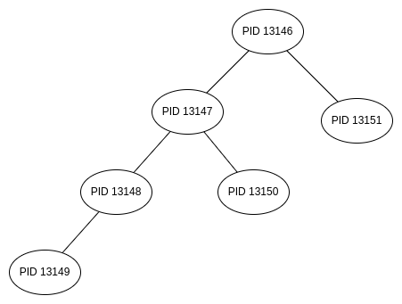

# Actividad 6 - Procesos e Hilos

**Instrucciones:**

Resolver cada uno de los problemas solicitados.

## 1. ¿Incluyendo el proceso inicial, cuantos procesos son creados por el siguiente
     programa?
     Razone su respuesta.

```c
1. #include <stdio.h>
2. #include <unistd.h>
3.
4. int main()
5. {
6.     /* fork a child process */
7.    fork();
8.
9.    /* fork another child process */
10.   fork();
11.
12.   /* and fork another */
13.   fork();
14.
15.   return 0;
16. }
```

**R.** Se crean 8 procesos

**Razonamiento**

En la línea 7 se crea un nuevo proceso hijo, se tiene el proceso principal
en ejecución, en total se tienen **2 procesos**

En la línea 10 se crean 2 procesos, uno por cada proceso en ejecución, en total se crean 2 procesos más,
teniendo **4 procesos** en ejecución.

En la línea 13 se cean 4 procesos más ya que se encuentran 4 procesos en ejecución,
haciendo un total de **8 procesos** en ejecución.


## 2. Utilizando un sistema Linux, escriba un programa en C que cree un proceso hijo (fork) que finalmente se convierta en un proceso zombie. Este proceso zombie debe permanecer en el sistema durante al menos 60 segundos. Los estados del proceso se pueden obtener del comando: ps -l

* Código fuente del programa: [main.c](./ejercicio3/src/main.c)

* Ejecución del programa


Al iniciar la ejecución se crea el proceso hijo (zombie) con pid 9590, al finalizar
el proceso hijo (zombie) queda en espera ya que el proceso padre con pid 9589 aún no termina
ejecutarse, el proceso padre espera 60 segundos para terminar de ejecutarse.


* Comando ps que muestra el estado de los procesos


Proceso padre con pid: 9589 y proceso hijo (zombie) con pid: 9590 que este caso es
un proceso zombie como lo indica su estado con la letra 'Z'

## 3. Usando el siguiente código como referencia, completar el programa para que sea ejecutable y responder las siguientes preguntas

```c
pid_t pid;

pid = fork();
if (pid == 0) { /* child process */
    fork();
    thread_create( ... );
}
fork();
```

Código fuente del programa: [main.c](./ejercicio3/src/main.c)

* Ejecución del programa


* Árbol del procesos




- **a) ¿Cuántos procesos únicos son creados?**

R. Se crean 6 procesos únicos

* **b) ¿Cuántos hilos únicos son creados?**

R. Se crean 6 hilos únicos
